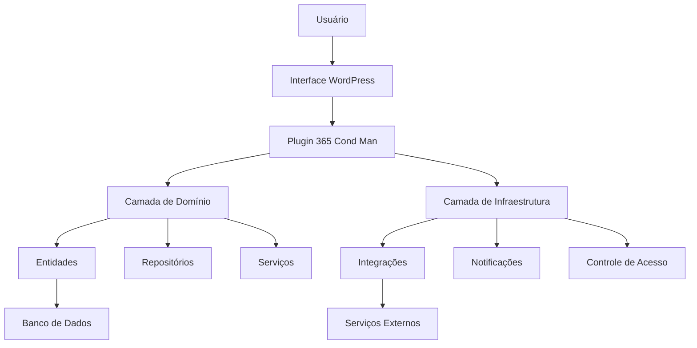
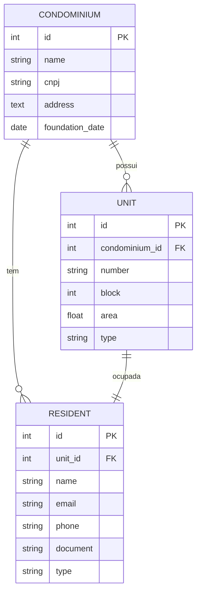

# Contexto de Desenvolvimento - Sistema de Gestão de Condomínio

## 1. Visão Geral do Projeto

O Sistema de Gestão de Condomínio é um módulo do WP Gestão 360 que visa automatizar e simplificar a administração de condomínios. O sistema atende às necessidades de síndicos, administradores e moradores, oferecendo uma plataforma integrada para gestão condominial.

## 2. Objetivos do Projeto

### 2.1 Objetivos Principais

1. Automatizar processos administrativos
2. Reduzir custos operacionais
3. Melhorar a comunicação entre moradores e administração
4. Aumentar a transparência na gestão
5. Facilitar o controle financeiro

### 2.2 Público-Alvo

- Síndicos
- Administradoras de condomínio
- Moradores
- Funcionários do condomínio
- Prestadores de serviço

### 2.3 Capacidades dos Atores

#### Síndico
- **Gestão Administrativa**
  - Cadastrar e gerenciar unidades
  - Visualizar lista de moradores
  - Registrar ocorrências
  - Aprovar reservas de áreas comuns
  - Emitir comunicados

- **Gestão Financeira**
  - Gerar boletos de taxas condominiais
  - Visualizar relatórios financeiros
  - Acompanhar inadimplência
  - Gerenciar fornecedores

- **Comunicação**
  - Enviar comunicados gerais
  - Notificar moradores
  - Gerenciar avisos importantes

#### Administrador de Condomínio
- **Gestão Completa**
  - Todos os recursos do síndico
  - Configurações avançadas do sistema
  - Gestão de múltiplos condomínios

- **Relatórios Gerenciais**
  - Relatórios financeiros detalhados
  - Análise de inadimplência
  - Histórico de ocorrências
  - Indicadores de gestão

- **Integrações**
  - Configurar integrações externas
  - Sincronizar dados financeiros
  - Conectar sistemas de terceiros

#### Morador
- **Perfil Básico**
  - Visualizar informações da unidade
  - Consultar taxa condominial
  - Emitir segunda via de boleto

- **Comunicação**
  - Registrar ocorrências
  - Solicitar serviços
  - Visualizar comunicados
  - Reservar áreas comuns

- **Financeiro**
  - Consultar histórico de pagamentos
  - Visualizar débitos
  - Atualizar dados cadastrais

#### Funcionário do Condomínio
- **Operações**
  - Registrar entrada/saída de visitantes
  - Gerenciar chamados de manutenção
  - Acompanhar solicitações

- **Comunicação**
  - Responder ocorrências
  - Atualizar status de serviços
  - Comunicar-se com moradores

#### Prestador de Serviço
- **Gestão de Serviços**
  - Visualizar chamados
  - Registrar execução de serviços
  - Anexar comprovantes
  - Emitir relatórios de execução

### 2.4 Matriz de Permissões

| Recurso | Síndico | Administrador | Morador | Funcionário | Prestador |
|---------|---------|--------------|---------|-------------|-----------|
| Visualizar Unidades | ✓ | ✓ | Própria | ✓ | - |
| Registrar Ocorrências | ✓ | ✓ | ✓ | ✓ | - |
| Gerar Boletos | ✓ | ✓ | - | - | - |
| Reservar Áreas | ✓ | ✓ | ✓ | - | - |
| Configurações Sistema | - | ✓ | - | - | - |
| Comunicados | ✓ | ✓ | Receber | ✓ | - |
| Relatórios Financeiros | ✓ | ✓ | Próprio | - | - |

### 2.5 Fluxos de Trabalho Típicos

#### Fluxo de Ocorrência
1. Morador registra ocorrência
2. Funcionário analisa
3. Síndico aprova/rejeita
4. Prestador executa
5. Morador avalia

#### Fluxo Financeiro
1. Sistema gera boletos
2. Morador recebe notificação
3. Pagamento registrado automaticamente
4. Síndico/Administrador acompanha

## 3. Requisitos do Sistema

### 3.1 Requisitos Funcionais

1. **Gestão de Unidades**
   - Cadastro de unidades
   - Histórico de proprietários
   - Status de ocupação

2. **Gestão de Moradores**
   - Cadastro completo
   - Perfis de acesso
   - Histórico de ocorrências

3. **Gestão Financeira**
   - Controle de taxas
   - Geração de boletos
   - Relatórios financeiros

4. **Reservas**
   - Agendamento de áreas comuns
   - Calendário de eventos
   - Regras de utilização

5. **Ocorrências**
   - Registro de problemas
   - Acompanhamento de status
   - Notificações

### 3.2 Requisitos Não Funcionais

1. **Performance**
   - Tempo de resposta < 2s
   - Suporte a 1000+ usuários simultâneos
   - Cache eficiente

2. **Segurança**
   - Criptografia de dados sensíveis
   - Autenticação segura
   - Backup automático

3. **Usabilidade**
   - Interface responsiva
   - UX intuitiva
   - Acessibilidade WCAG 2.1

## 4. Stack Tecnológica

### 4.1 Backend
- PHP 8.0+
- WordPress Core
- MySQL 5.7+
- REST API

### 4.2 Frontend
- React.js
- WordPress Hooks
- SASS/SCSS
- Bootstrap 5

### 4.3 Infraestrutura
- Docker
- Nginx
- Redis (cache) (se tiver instalado)
- Git

## 5. Processo de Desenvolvimento

### 5.1 Metodologia
- Scrum adaptado
- Sprints de 2 semanas
- Code review obrigatório
- TDD quando aplicável

### 5.2 Padrões de Código
- PSR-12 para PHP
- ESLint para JavaScript
- PHPCS para WordPress
- Conventional Commits

### 5.3 Fluxo de Trabalho
1. Criação de branch feature
2. Desenvolvimento local
3. Testes unitários
4. Code review
5. Merge para develop
6. Deploy para staging
7. Testes de QA
8. Deploy para produção

## 6. Ambiente de Desenvolvimento

### 6.1 Estrutura do Projeto
```bash
365condman/
├── assets/                 # Recursos estáticos
│   ├── css/                # Folhas de estilo
│   │   ├── admin/          # Estilos administrativos
│   │   └── public/         # Estilos públicos
│   ├── js/                 # Scripts JavaScript
│   │   ├── admin/          # Scripts administrativos
│   │   └── public/         # Scripts públicos
│   ├── images/             # Imagens do plugin
│   └── fonts/              # Fontes personalizadas
├── includes/               # Código PHP do plugin
│   ├── core/
│   │   ├── abstracts/      # Classes abstratas base
│   │   ├── interfaces/     # Contratos de implementação
│   │   └── traits/         # Comportamentos reutilizáveis
│   ├── domain/             # Lógica de negócio
│   │   ├── entities/       # Modelos de dados
│   │   ├── repositories/   # Persistência de dados
│   │   └── services/       # Regras de negócio
│   ├── infrastructure/     # Implementações técnicas
│   │   ├── integrations/   # Conexões externas
│   │   ├── notifications/  # Canais de comunicação
│   │   └── access_control/ # Gerenciamento de permissões
│   └── utils/              # Utilitários transversais
├── admin/                  # Componentes administrativos
├── public/                 # Componentes públicos
├── tests/                  # Suíte de testes
├── docker-compose.yml      # Configuração Docker
└── README.md               # Documentação principal
```

### 6.2 Configuração Inicial
```bash
# Clonar repositório
git clone [repo]

# Instalar dependências
composer install
npm install

# Iniciar ambiente Docker
docker-compose up -d

# Configurar WordPress
./scripts/setup-wp.sh
```

### 6.3 Dependências e Ferramentas

#### Gerenciamento de Dependências
- **Composer**: Dependências PHP
- **NPM/Yarn**: Dependências JavaScript

#### Ferramentas de Desenvolvimento
- **PHP**: Versão 7.4+
- **WordPress**: Versão 5.6+
- **Docker**: Ambiente de desenvolvimento

#### Bibliotecas Principais
- **PSR-4**: Autoloading
- **Dependency Injection**: Inversão de controle
- **PHPUnit**: Testes unitários
- **Monolog**: Logging
- **Symfony Components**: Utilitários

### 6.4 Variáveis de Ambiente
```bash
# Configurações de desenvolvimento
WP_DEBUG=true
WP_DEBUG_LOG=/var/www/html/wp-content/debug.log
WP_DEBUG_DISPLAY=false

# Credenciais de banco de dados
WORDPRESS_DB_HOST=db
WORDPRESS_DB_USER=wordpress
WORDPRESS_DB_PASSWORD=wordpress
WORDPRESS_DB_NAME=wordpress
```

### 6.5 Scripts Auxiliares
```bash
# Scripts no diretório /scripts/
setup-wp.sh       # Configuração inicial do WordPress
database-backup.sh # Backup do banco de dados
deploy.sh         # Deploy para diferentes ambientes
```

### 6.6 Boas Práticas de Configuração
- Usar `.env` para configurações sensíveis
- Manter segredos fora do controle de versão
- Configurar diferentes ambientes (dev, staging, prod)
- Usar variáveis de ambiente para configurações
- Documentar requisitos e dependências

## 7. Estrutura de Namespaces

### 7.1 Visão Geral
O plugin 365 Cond Man utiliza uma arquitetura de namespaces modular e organizada, seguindo as melhores práticas de desenvolvimento PHP e WordPress.

### 7.2 Namespace Base
- **Namespace Raiz**: `CondMan`
- **Subnamespaces**:
  - `CondMan\Core`: Componentes centrais
  - `CondMan\Domain`: Lógica de negócio
  - `CondMan\Infrastructure`: Implementações técnicas
  - `CondMan\Admin`: Componentes administrativos
  - `CondMan\Public`: Componentes públicos

### 7.3 Detalhamento dos Namespaces

#### `CondMan\Core`
- Abstrações fundamentais
- Interfaces principais
- Traits utilitários
```php
namespace CondMan\Core\Abstracts;
abstract class AbstractEntity { ... }

namespace CondMan\Core\Interfaces;
interface EntityInterface { ... }

namespace CondMan\Core\Traits;
trait Validatable { ... }
```

#### `CondMan\Domain`
- Entidades de negócio
- Repositórios
- Serviços
```php
namespace CondMan\Domain\Entities;
class Condominium implements \CondMan\Core\Interfaces\EntityInterface { ... }

namespace CondMan\Domain\Repositories;
class CondominiumRepository implements \CondMan\Core\Interfaces\RepositoryInterface { ... }

namespace CondMan\Domain\Services;
class CondominiumService implements \CondMan\Core\Interfaces\ServiceInterface { ... }
```

#### `CondMan\Infrastructure`
- Integrações
- Notificações
- Controle de acesso
```php
namespace CondMan\Infrastructure\Integrations;
class PaymentIntegration implements IntegrationInterface { ... }

namespace CondMan\Infrastructure\Notifications;
class EmailNotification implements NotificationInterface { ... }

namespace CondMan\Infrastructure\AccessControl;
class RoleManager implements PermissionInterface { ... }
```

#### `CondMan\Admin` e `CondMan\Public`
- Controladores
- Views
- Componentes específicos
```php
namespace CondMan\Admin\Controllers;
class DashboardController { ... }

namespace CondMan\Public\Controllers;
class ResidentPortalController { ... }
```

### 7.4 Convenções de Namespace
- Mapeamento direto entre namespace e estrutura de diretórios
- Nomes de classes em PascalCase
- Arquivos de classe em snake_case
- Uso de PSR-4 para autoloading
- Interfaces com sufixo `Interface`
- Classes abstratas com prefixo `Abstract`

### 7.5 Estratégias de Autoload
```php
// composer.json
{
    "autoload": {
        "psr-4": {
            "CondMan\\": "includes/"
        }
    }
}
```

### 7.6 Benefícios da Abordagem
- Organização clara do código
- Prevenção de conflitos
- Facilidade de manutenção
- Modularidade
- Extensibilidade

## 8. Boas Práticas

### 8.1 Código
- Documentação PHPDoc
- Testes unitários
- Clean Code
- DRY (Don't Repeat Yourself)

### 8.2 Git
- Branches por feature
- Commits semânticos
- Pull requests descritivos
- Squash merges

### 8.3 Segurança
- Validação de inputs
- Escape de outputs
- Princípio do menor privilégio
- Auditoria de código

## 9. Recursos e Documentação

### 9.1 Documentação
- Swagger para API
- PHPDoc para código
- Wiki do projeto
- Guias de usuário

### 9.2 Ferramentas
- PHPStorm/VSCode
- Postman/Insomnia
- Git Flow
- Docker Desktop

## 10. Suporte e Manutenção

### 10.1 Monitoramento
- Logs centralizados
- Métricas de performance
- Alertas automáticos
- Analytics de uso

### 10.2 Backup
- Backup diário do banco
- Versionamento de código
- Disaster recovery plan
- Retenção de 30 dias

## 11. Abstrações Específicas do Projeto

### 11.1 Abstração de Entidades de Domínio

#### Interface de Entidades
```php
interface EntityInterface {
    public function getId(): int;
    public function getCreatedAt(): \DateTimeInterface;
    public function getUpdatedAt(): \DateTimeInterface;
}

abstract class AbstractEntity implements EntityInterface {
    protected $id;
    protected $createdAt;
    protected $updatedAt;

    // Métodos comuns para todas as entidades
    public function validate(): bool {
        // Validação básica
    }
}
```

#### Entidades do Domínio
- `Condominium`: Representa um condomínio
- `Unit`: Representa uma unidade/apartamento
- `Resident`: Representa um morador
- `FinancialRecord`: Registros financeiros
- `Incident`: Ocorrências e chamados

### 11.2 Abstração de Repositórios

#### Repositório Genérico
```php
interface RepositoryInterface {
    public function findById(int $id);
    public function findAll(array $criteria = []);
    public function create($entity);
    public function update($entity);
    public function delete(int $id);
}

abstract class AbstractRepository implements RepositoryInterface {
    protected $wpdb;
    protected $table;

    // Métodos comuns de persistência
    protected function sanitizeInput($data): array {
        // Sanitização genérica
    }
}
```

### 11.3 Abstração de Serviços

#### Interface de Serviços
```php
interface ServiceInterface {
    public function process($data);
    public function validate($data): bool;
}

abstract class AbstractService implements ServiceInterface {
    protected $repository;
    protected $validator;

    // Lógica de processamento comum
    public function process($data) {
        if (!$this->validate($data)) {
            throw new \InvalidArgumentException('Dados inválidos');
        }
        // Lógica de processamento
    }
}
```

### 11.4 Abstração de Notificações

#### Sistema de Notificações
```php
interface NotificationInterface {
    public function send($recipient, $message);
    public function log($message);
}

abstract class AbstractNotification implements NotificationInterface {
    protected $channels = [];

    public function addChannel(NotificationChannelInterface $channel) {
        $this->channels[] = $channel;
    }
}

interface NotificationChannelInterface {
    public function send($recipient, $message);
}
```

### 11.5 Abstração de Permissões

#### Gerenciamento de Acesso
```php
interface PermissionInterface {
    public function can(string $action, ?User $user = null): bool;
    public function cannot(string $action, ?User $user = null): bool;
}

abstract class AbstractAccessControl implements PermissionInterface {
    protected $capabilities = [];

    public function registerCapability(string $capability, callable $checker) {
        $this->capabilities[$capability] = $checker;
    }
}
```

### 11.6 Abstração de Configurações

#### Gerenciamento de Configurações
```php
interface ConfigurationInterface {
    public function get(string $key, $default = null);
    public function set(string $key, $value);
    public function has(string $key): bool;
}

abstract class AbstractConfiguration implements ConfigurationInterface {
    protected $settings = [];
    protected $defaults = [];

    // Métodos para carregar configurações
    abstract protected function loadSettings();
}
```

### 11.7 Abstração de Integração

#### Estratégia de Integração
```php
interface IntegrationInterface {
    public function connect();
    public function disconnect();
    public function sendData($data);
    public function receiveData();
}

abstract class AbstractIntegration implements IntegrationInterface {
    protected $config;
    
    // Métodos comuns de integração
    protected function log($message) {
        // Logging de operações de integração
    }
}
```

### 11.8 Padrões de Implementação

#### Estratégias de Uso
- Injeção de Dependência
- Composição sobre Herança
- Programação para Interfaces
- Inversão de Controle

### 11.9 Considerações Finais

#### Diretrizes de Abstração
- Manter interfaces enxutas
- Evitar abstração prematura
- Documentar contratos claramente
- Priorizar simplicidade
- Permitir extensibilidade

## 12. Arquitetura e Modelagem

### 12.1 Diagrama de Arquitetura


### 12.2 Modelo de Dados


### 12.3 Especificações de Integração

#### Protocolos Suportados
- REST API
- WebHooks
- GraphQL (futuro)

#### Integrações Planejadas
1. **Sistemas Financeiros**
   - Integração com sistemas bancários
   - Geração de boletos
   - Conciliação automática

2. **Comunicação**
   - Envio de SMS
   - Notificações por e-mail
   - Integração com WhatsApp

3. **Serviços Externos**
   - Consulta de documentos
   - Validação de inadimplência
   - Serviços de autenticação

#### Exemplo de Configuração de Integração
```php
class IntegrationManager {
    private $integrations = [];
    
    public function registerIntegration(IntegrationInterface $integration) {
        $this->integrations[] = $integration;
    }
    
    public function processData($data) {
        foreach ($this->integrations as $integration) {
            $integration->send($data);
        }
    }
}
```

## 13. Estratégias de Desenvolvimento

### 13.1 Política de Contribuição

#### Fluxo de Contribuição
1. Fork do repositório
2. Criar branch de feature
3. Desenvolver código
4. Testes unitários
5. Documentação
6. Pull Request

#### Critérios de Aceitação
- Cobertura de testes > 80%
- Seguir guia de estilo
- Documentação atualizada
- Code review aprovado

#### Guia de Estilo
- Identação: 4 espaços
- Máximo 120 caracteres por linha
- Comentários explicativos
- Nomes descritivos

### 13.2 Processos de Code Review

#### Checklist de Revisão
- [ ] Código segue padrões de estilo
- [ ] Testes unitários adicionados
- [ ] Documentação atualizada
- [ ] Sem duplicação de código
- [ ] Tratamento de erros adequado
- [ ] Performance considerada

#### Ferramentas de Análise
- PHPStan (análise estática)
- PHPCS (padrões de código)
- Code Climate (qualidade)

### 13.3 Estratégias de Teste

#### Tipos de Teste
1. **Unitários**
   - Testar componentes isoladamente
   - Cobertura mínima de 80%
   - Usar PHPUnit

2. **Integração**
   - Testar interações entre componentes
   - Simular cenários reais
   - Verificar integrações externas

3. **Aceitação**
   - Testes de ponta a ponta
   - Cenários de usuário
   - Ferramentas: Codeception

#### Exemplo de Teste Unitário
```php
class CondominiumServiceTest extends TestCase {
    public function testCreateCondominium() {
        $service = new CondominiumService();
        $condominium = $service->create([
            'name' => 'Residencial Teste',
            'cnpj' => '12.345.678/0001-90'
        ]);
        
        $this->assertInstanceOf(Condominium::class, $condominium);
        $this->assertEquals('Residencial Teste', $condominium->getName());
    }
}
```

### 13.4 Troubleshooting

#### Logs e Monitoramento
- Níveis de log configuráveis
- Rastreamento de erros
- Alertas automáticos
- Analytics de uso

#### Guia de Solução de Problemas
1. Verificar logs de erro
2. Validar configurações
3. Checar compatibilidade
4. Modo de depuração
5. Restaurar configurações padrão

#### Exemplo de Configuração de Log
```php
class Logger {
    public function log($level, $message, $context = []) {
        // Implementação de logging
        switch($level) {
            case 'error':
                // Log detalhado
                break;
            case 'warning':
                // Log de alerta
                break;
        }
    }
}

## 14. Registro de Alterações

Todas as modificações significativas no projeto devem ser documentadas no arquivo [CHANGELOG.md](/CHANGELOG.md).

### Diretrizes para Registro de Alterações

#### O que Registrar
- Novas funcionalidades
- Correções de bugs
- Alterações na arquitetura
- Mudanças de dependências
- Atualizações de segurança

#### Formato de Registro
Siga o padrão de [Semantic Versioning](https://semver.org/):
- **MAJOR**: Alterações incompatíveis da API
- **MINOR**: Funcionalidades retrocompatíveis
- **PATCH**: Correções de bugs

#### Exemplo de Entrada no Changelog
```markdown
## [1.1.0] - YYYY-MM-DD
### Adicionado
- Nova funcionalidade X
- Suporte para Y

### Modificado
- Refatoração do módulo Z

### Corrigido
- Bug na autenticação
```

#### Processo de Registro
1. Identifique a mudança significativa
2. Determine a categoria (adicionado/modificado/corrigido)
3. Registre no CHANGELOG.md
4. Faça commit com descrição clara

### Boas Práticas
- Mantenha entradas sucintas e claras
- Use linguagem descritiva
- Referencie issues ou pull requests
- Priorize a perspectiva do usuário
